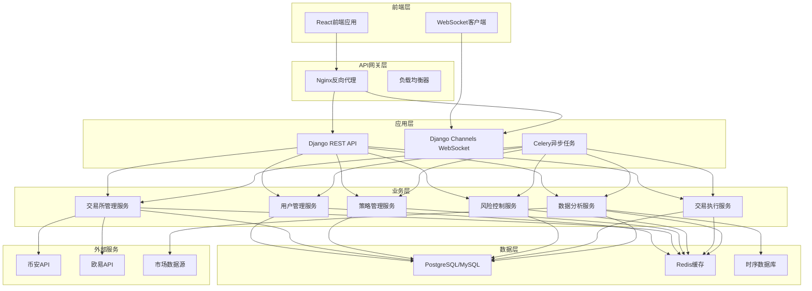
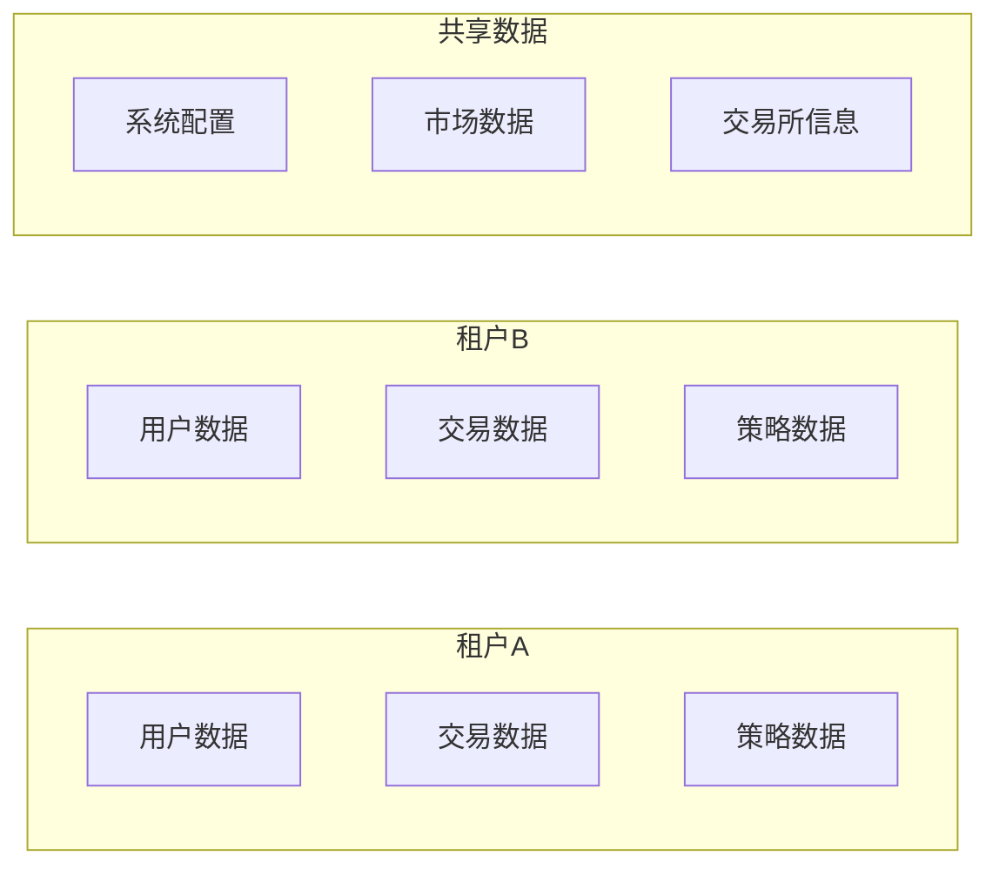
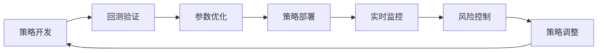
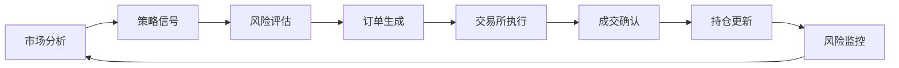
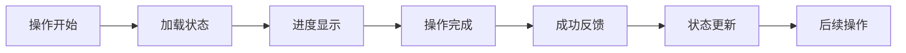
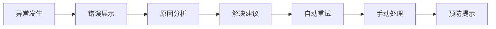
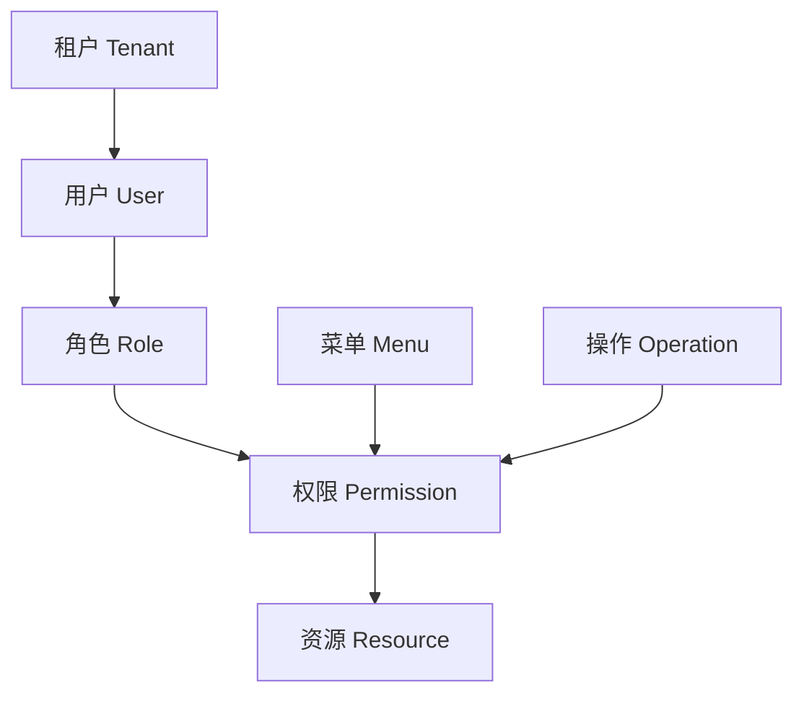

# 设计文档

## 概述

QuantTrade量化交易系统采用现代化的微服务架构设计，基于Django + React技术栈，支持多租户、高并发、高可用的量化交易需求。系统设计遵循领域驱动设计(DDD)原则，采用分层架构模式，确保代码的可维护性和可扩展性。

## 架构设计

### 系统架构图



### 多租户架构设计

系统采用基于数据库Schema的多租户隔离模式：



## 组件和接口

### 核心组件架构

#### 1. 用户管理组件
- **TenantManager**: 租户管理器，负责租户创建、隔离、权限控制
- **AuthenticationService**: 认证服务，基于JWT的用户认证
- **PermissionService**: 权限服务，基于RBAC的权限控制
- **UserProfileService**: 用户资料服务，管理用户个人信息

#### 2. 交易所管理组件
- **ExchangeConnector**: 交易所连接器，基于CCXT的统一接口
- **APIKeyManager**: API密钥管理器，安全存储和管理API密钥
- **AccountManager**: 账户管理器，管理多交易所账户状态
- **AssetMonitor**: 资产监控器，实时监控各交易所资产

#### 3. 市场数据组件
- **MarketDataCollector**: 市场数据收集器，从多个数据源收集数据
- **DataProcessor**: 数据处理器，清洗和标准化市场数据
- **TechnicalIndicator**: 技术指标计算器，计算各种技术指标
- **DataStorage**: 数据存储器，高效存储历史数据

#### 4. 策略管理组件
- **StrategyEngine**: 策略引擎，执行用户策略代码
- **BacktestEngine**: 回测引擎，高性能历史数据回测
- **ParameterOptimizer**: 参数优化器，使用遗传算法优化参数
- **StrategyRepository**: 策略仓库，版本控制和策略管理

#### 5. 风险控制组件
- **RiskCalculator**: 风险计算器，实时计算各种风险指标
- **AlertManager**: 预警管理器，多级风险预警机制
- **StopLossManager**: 止损管理器，自动止损止盈执行
- **RiskReporter**: 风险报告器，生成风险分析报告

#### 6. 交易执行组件
- **OrderManager**: 订单管理器，统一订单生命周期管理
- **TradeExecutor**: 交易执行器，自动化交易执行
- **PositionManager**: 持仓管理器，实时持仓状态管理
- **TradeRecorder**: 交易记录器，完整交易历史记录

### 接口设计

#### REST API接口

```python
# 用户管理接口
POST /api/v1/auth/login/          # 用户登录
POST /api/v1/auth/logout/         # 用户登出
GET  /api/v1/users/profile/       # 获取用户资料
PUT  /api/v1/users/profile/       # 更新用户资料

# 交易所管理接口
GET    /api/v1/exchanges/         # 获取交易所列表
POST   /api/v1/exchanges/         # 添加交易所配置
PUT    /api/v1/exchanges/{id}/    # 更新交易所配置
DELETE /api/v1/exchanges/{id}/    # 删除交易所配置
POST   /api/v1/exchanges/{id}/test/ # 测试交易所连接

# 市场数据接口
GET /api/v1/market/symbols/       # 获取交易对列表
GET /api/v1/market/ticker/{symbol}/ # 获取实时价格
GET /api/v1/market/klines/{symbol}/ # 获取K线数据
GET /api/v1/market/depth/{symbol}/  # 获取深度数据

# 策略管理接口
GET    /api/v1/strategies/        # 获取策略列表
POST   /api/v1/strategies/        # 创建新策略
PUT    /api/v1/strategies/{id}/   # 更新策略
DELETE /api/v1/strategies/{id}/   # 删除策略
POST   /api/v1/strategies/{id}/backtest/ # 执行回测

# 交易管理接口
GET    /api/v1/orders/            # 获取订单列表
POST   /api/v1/orders/            # 创建订单
PUT    /api/v1/orders/{id}/       # 修改订单
DELETE /api/v1/orders/{id}/       # 取消订单
GET    /api/v1/positions/         # 获取持仓信息

# 风险管理接口
GET /api/v1/risk/metrics/         # 获取风险指标
GET /api/v1/risk/alerts/          # 获取风险预警
POST /api/v1/risk/alerts/         # 创建风险预警规则
```

#### WebSocket接口

```python
# 实时数据推送
ws://domain/ws/market/{symbol}/   # 市场数据推送
ws://domain/ws/orders/            # 订单状态推送
ws://domain/ws/positions/         # 持仓变化推送
ws://domain/ws/alerts/            # 风险预警推送
```

## 数据模型

### 核心数据模型设计

#### 1. 用户和租户模型

```python
class Tenant(models.Model):
    """租户模型"""
    name = models.CharField(max_length=100)
    schema_name = models.CharField(max_length=63, unique=True)
    created_at = models.DateTimeField(auto_now_add=True)
    is_active = models.BooleanField(default=True)

class User(AbstractUser):
    """用户模型"""
    tenant = models.ForeignKey(Tenant, on_delete=models.CASCADE)
    phone = models.CharField(max_length=20, blank=True)
    avatar = models.ImageField(upload_to='avatars/', blank=True)
    last_login_ip = models.GenericIPAddressField(blank=True, null=True)
    
class Role(models.Model):
    """角色模型"""
    name = models.CharField(max_length=50)
    permissions = models.ManyToManyField('Permission')
    tenant = models.ForeignKey(Tenant, on_delete=models.CASCADE)

class Permission(models.Model):
    """权限模型"""
    name = models.CharField(max_length=100)
    codename = models.CharField(max_length=100)
    content_type = models.ForeignKey(ContentType, on_delete=models.CASCADE)
```

#### 2. 交易所和账户模型

```python
class Exchange(models.Model):
    """交易所模型"""
    name = models.CharField(max_length=50)
    code = models.CharField(max_length=20, unique=True)
    api_url = models.URLField()
    is_active = models.BooleanField(default=True)

class ExchangeAccount(models.Model):
    """交易所账户模型"""
    user = models.ForeignKey(User, on_delete=models.CASCADE)
    exchange = models.ForeignKey(Exchange, on_delete=models.CASCADE)
    api_key = models.CharField(max_length=255)
    secret_key = models.CharField(max_length=255)
    passphrase = models.CharField(max_length=255, blank=True)
    is_testnet = models.BooleanField(default=False)
    is_active = models.BooleanField(default=True)
    created_at = models.DateTimeField(auto_now_add=True)

class Asset(models.Model):
    """资产模型"""
    account = models.ForeignKey(ExchangeAccount, on_delete=models.CASCADE)
    symbol = models.CharField(max_length=20)
    total = models.DecimalField(max_digits=20, decimal_places=8)
    available = models.DecimalField(max_digits=20, decimal_places=8)
    locked = models.DecimalField(max_digits=20, decimal_places=8)
    updated_at = models.DateTimeField(auto_now=True)
```

#### 3. 市场数据模型

```python
class Symbol(models.Model):
    """交易对模型"""
    exchange = models.ForeignKey(Exchange, on_delete=models.CASCADE)
    symbol = models.CharField(max_length=20)
    base_asset = models.CharField(max_length=10)
    quote_asset = models.CharField(max_length=10)
    is_active = models.BooleanField(default=True)

class Kline(models.Model):
    """K线数据模型"""
    symbol = models.ForeignKey(Symbol, on_delete=models.CASCADE)
    timeframe = models.CharField(max_length=10)
    timestamp = models.DateTimeField()
    open_price = models.DecimalField(max_digits=20, decimal_places=8)
    high_price = models.DecimalField(max_digits=20, decimal_places=8)
    low_price = models.DecimalField(max_digits=20, decimal_places=8)
    close_price = models.DecimalField(max_digits=20, decimal_places=8)
    volume = models.DecimalField(max_digits=20, decimal_places=8)
    
    class Meta:
        unique_together = ['symbol', 'timeframe', 'timestamp']
        indexes = [
            models.Index(fields=['symbol', 'timeframe', 'timestamp']),
        ]
```

#### 4. 策略和回测模型

```python
class Strategy(models.Model):
    """策略模型"""
    user = models.ForeignKey(User, on_delete=models.CASCADE)
    name = models.CharField(max_length=100)
    description = models.TextField(blank=True)
    code = models.TextField()
    parameters = models.JSONField(default=dict)
    is_active = models.BooleanField(default=False)
    created_at = models.DateTimeField(auto_now_add=True)
    updated_at = models.DateTimeField(auto_now=True)

class Backtest(models.Model):
    """回测模型"""
    strategy = models.ForeignKey(Strategy, on_delete=models.CASCADE)
    start_date = models.DateTimeField()
    end_date = models.DateTimeField()
    initial_capital = models.DecimalField(max_digits=20, decimal_places=2)
    final_capital = models.DecimalField(max_digits=20, decimal_places=2)
    total_return = models.DecimalField(max_digits=10, decimal_places=4)
    max_drawdown = models.DecimalField(max_digits=10, decimal_places=4)
    sharpe_ratio = models.DecimalField(max_digits=10, decimal_places=4)
    win_rate = models.DecimalField(max_digits=5, decimal_places=2)
    created_at = models.DateTimeField(auto_now_add=True)
```

#### 5. 交易和订单模型

```python
class Order(models.Model):
    """订单模型"""
    ORDER_TYPES = [
        ('market', '市价单'),
        ('limit', '限价单'),
        ('stop', '止损单'),
        ('stop_limit', '止损限价单'),
    ]
    
    ORDER_SIDES = [
        ('buy', '买入'),
        ('sell', '卖出'),
    ]
    
    ORDER_STATUS = [
        ('pending', '待成交'),
        ('partial', '部分成交'),
        ('filled', '已成交'),
        ('cancelled', '已取消'),
        ('rejected', '已拒绝'),
    ]
    
    user = models.ForeignKey(User, on_delete=models.CASCADE)
    account = models.ForeignKey(ExchangeAccount, on_delete=models.CASCADE)
    symbol = models.CharField(max_length=20)
    order_type = models.CharField(max_length=20, choices=ORDER_TYPES)
    side = models.CharField(max_length=10, choices=ORDER_SIDES)
    amount = models.DecimalField(max_digits=20, decimal_places=8)
    price = models.DecimalField(max_digits=20, decimal_places=8, null=True)
    status = models.CharField(max_length=20, choices=ORDER_STATUS)
    exchange_order_id = models.CharField(max_length=100, blank=True)
    filled_amount = models.DecimalField(max_digits=20, decimal_places=8, default=0)
    average_price = models.DecimalField(max_digits=20, decimal_places=8, null=True)
    created_at = models.DateTimeField(auto_now_add=True)
    updated_at = models.DateTimeField(auto_now=True)

class Trade(models.Model):
    """交易记录模型"""
    order = models.ForeignKey(Order, on_delete=models.CASCADE)
    trade_id = models.CharField(max_length=100)
    price = models.DecimalField(max_digits=20, decimal_places=8)
    amount = models.DecimalField(max_digits=20, decimal_places=8)
    fee = models.DecimalField(max_digits=20, decimal_places=8)
    fee_currency = models.CharField(max_length=10)
    timestamp = models.DateTimeField()
```

### 数据库设计原则

1. **多租户隔离**: 使用tenant_id字段确保数据隔离
2. **索引优化**: 为查询频繁的字段创建索引
3. **数据分区**: 对历史数据进行时间分区
4. **缓存策略**: 热点数据使用Redis缓存
5. **数据一致性**: 使用事务确保数据一致性

## 错误处理

### 异常处理架构

```python
class QuantTradeException(Exception):
    """系统基础异常类"""
    def __init__(self, message, error_code=None, details=None):
        self.message = message
        self.error_code = error_code
        self.details = details or {}
        super().__init__(self.message)

class ExchangeException(QuantTradeException):
    """交易所相关异常"""
    pass

class StrategyException(QuantTradeException):
    """策略相关异常"""
    pass

class RiskException(QuantTradeException):
    """风险控制异常"""
    pass
```

### 错误处理中间件

```python
class ErrorHandlingMiddleware:
    """统一错误处理中间件"""
    
    def __init__(self, get_response):
        self.get_response = get_response
    
    def __call__(self, request):
        try:
            response = self.get_response(request)
        except QuantTradeException as e:
            return self.handle_quanttrade_exception(e)
        except Exception as e:
            return self.handle_generic_exception(e)
        return response
    
    def handle_quanttrade_exception(self, exception):
        """处理系统自定义异常"""
        return JsonResponse({
            'error': True,
            'message': exception.message,
            'error_code': exception.error_code,
            'details': exception.details
        }, status=400)
    
    def handle_generic_exception(self, exception):
        """处理通用异常"""
        logger.error(f"Unhandled exception: {exception}", exc_info=True)
        return JsonResponse({
            'error': True,
            'message': '系统内部错误',
            'error_code': 'INTERNAL_ERROR'
        }, status=500)
```

### 重试机制

```python
from functools import wraps
import time
import random

def retry_on_exception(max_retries=3, delay=1, backoff=2, exceptions=(Exception,)):
    """重试装饰器"""
    def decorator(func):
        @wraps(func)
        def wrapper(*args, **kwargs):
            retries = 0
            while retries < max_retries:
                try:
                    return func(*args, **kwargs)
                except exceptions as e:
                    retries += 1
                    if retries >= max_retries:
                        raise e
                    
                    wait_time = delay * (backoff ** (retries - 1))
                    jitter = random.uniform(0, 0.1) * wait_time
                    time.sleep(wait_time + jitter)
            
            return func(*args, **kwargs)
        return wrapper
    return decorator
```

## 测试策略

### 测试架构设计

#### 1. 单元测试
- **模型测试**: 测试数据模型的验证和业务逻辑
- **服务测试**: 测试业务服务的核心功能
- **工具测试**: 测试工具类和辅助函数

#### 2. 集成测试
- **API测试**: 测试REST API接口的完整流程
- **数据库测试**: 测试数据库操作和事务
- **外部服务测试**: 测试与交易所API的集成

#### 3. 端到端测试
- **用户流程测试**: 测试完整的用户操作流程
- **交易流程测试**: 测试完整的交易执行流程
- **策略测试**: 测试策略的完整生命周期

### 测试数据管理

```python
# 测试工厂类
class UserFactory(factory.django.DjangoModelFactory):
    class Meta:
        model = User
    
    username = factory.Sequence(lambda n: f"user{n}")
    email = factory.LazyAttribute(lambda obj: f"{obj.username}@example.com")
    tenant = factory.SubFactory(TenantFactory)

class ExchangeAccountFactory(factory.django.DjangoModelFactory):
    class Meta:
        model = ExchangeAccount
    
    user = factory.SubFactory(UserFactory)
    exchange = factory.SubFactory(ExchangeFactory)
    api_key = factory.Faker('uuid4')
    secret_key = factory.Faker('uuid4')
    is_testnet = True

# 测试用例示例
class ExchangeAccountTestCase(TestCase):
    def setUp(self):
        self.user = UserFactory()
        self.exchange = ExchangeFactory()
    
    def test_create_exchange_account(self):
        account = ExchangeAccountFactory(
            user=self.user,
            exchange=self.exchange
        )
        self.assertTrue(account.is_testnet)
        self.assertTrue(account.is_active)
    
    @patch('ccxt.binance')
    def test_exchange_connection(self, mock_binance):
        mock_exchange = Mock()
        mock_binance.return_value = mock_exchange
        mock_exchange.fetch_balance.return_value = {'BTC': {'total': 1.0}}
        
        account = ExchangeAccountFactory(user=self.user)
        connector = ExchangeConnector(account)
        balance = connector.get_balance()
        
        self.assertEqual(balance['BTC']['total'], 1.0)
```

### 性能测试

```python
# 负载测试配置
class LoadTestConfig:
    """负载测试配置"""
    CONCURRENT_USERS = 100
    RAMP_UP_TIME = 60  # 秒
    TEST_DURATION = 300  # 秒
    
    API_ENDPOINTS = [
        '/api/v1/market/ticker/BTCUSDT/',
        '/api/v1/orders/',
        '/api/v1/positions/',
        '/api/v1/strategies/',
    ]

# 性能基准测试
class PerformanceBenchmark:
    """性能基准测试"""
    
    def test_api_response_time(self):
        """测试API响应时间"""
        start_time = time.time()
        response = self.client.get('/api/v1/market/ticker/BTCUSDT/')
        end_time = time.time()
        
        response_time = end_time - start_time
        self.assertLess(response_time, 0.5)  # 响应时间小于500ms
    
    def test_database_query_performance(self):
        """测试数据库查询性能"""
        with self.assertNumQueries(1):
            list(Order.objects.select_related('user', 'account').all()[:100])
```

## 安全设计

### 认证和授权

#### JWT认证机制
```python
class JWTAuthentication:
    """JWT认证实现"""
    
    def authenticate(self, request):
        token = self.get_token_from_request(request)
        if not token:
            return None
        
        try:
            payload = jwt.decode(token, settings.SECRET_KEY, algorithms=['HS256'])
            user = User.objects.get(id=payload['user_id'])
            
            # 验证租户权限
            if not self.validate_tenant_access(user, request):
                raise AuthenticationFailed('租户权限验证失败')
            
            return (user, token)
        except (jwt.InvalidTokenError, User.DoesNotExist):
            raise AuthenticationFailed('无效的认证令牌')
    
    def validate_tenant_access(self, user, request):
        """验证租户访问权限"""
        tenant_id = request.headers.get('X-Tenant-ID')
        return user.tenant.id == int(tenant_id) if tenant_id else True
```

#### 权限控制
```python
class TenantPermission(BasePermission):
    """租户权限控制"""
    
    def has_permission(self, request, view):
        if not request.user.is_authenticated:
            return False
        
        # 检查租户权限
        return self.check_tenant_permission(request.user, view.action)
    
    def has_object_permission(self, request, view, obj):
        # 确保用户只能访问自己租户的数据
        return obj.user.tenant == request.user.tenant
```

### 数据安全

#### API密钥加密存储
```python
from cryptography.fernet import Fernet

class APIKeyManager:
    """API密钥管理器"""
    
    def __init__(self):
        self.cipher = Fernet(settings.ENCRYPTION_KEY)
    
    def encrypt_api_key(self, api_key):
        """加密API密钥"""
        return self.cipher.encrypt(api_key.encode()).decode()
    
    def decrypt_api_key(self, encrypted_key):
        """解密API密钥"""
        return self.cipher.decrypt(encrypted_key.encode()).decode()
```

#### 敏感数据脱敏
```python
class DataMasking:
    """数据脱敏工具"""
    
    @staticmethod
    def mask_api_key(api_key):
        """脱敏API密钥"""
        if len(api_key) <= 8:
            return '*' * len(api_key)
        return api_key[:4] + '*' * (len(api_key) - 8) + api_key[-4:]
    
    @staticmethod
    def mask_phone(phone):
        """脱敏手机号"""
        if len(phone) <= 7:
            return '*' * len(phone)
        return phone[:3] + '*' * 4 + phone[-4:]
```

### 安全审计

```python
class SecurityAuditLog(models.Model):
    """安全审计日志"""
    user = models.ForeignKey(User, on_delete=models.CASCADE)
    action = models.CharField(max_length=100)
    resource = models.CharField(max_length=100)
    ip_address = models.GenericIPAddressField()
    user_agent = models.TextField()
    timestamp = models.DateTimeField(auto_now_add=True)
    success = models.BooleanField()
    details = models.JSONField(default=dict)

class AuditMiddleware:
    """审计中间件"""
    
    def __init__(self, get_response):
        self.get_response = get_response
    
    def __call__(self, request):
        # 记录请求信息
        self.log_request(request)
        
        response = self.get_response(request)
        
        # 记录响应信息
        self.log_response(request, response)
        
        return response
```

这个设计文档涵盖了系统的核心架构、组件设计、数据模型、错误处理、测试策略和安全设计等关键方面。设计遵循了现代软件开发的最佳实践，确保系统的可维护性、可扩展性和安全性。
##
 用户界面设计

### UI/UX设计原则

系统采用现代化的Material Design设计语言，确保界面简洁、直观、易用。

#### 设计规范
- **色彩系统**: 主色调#1890FF，辅助色#52C41A、#FAAD14、#F5222D
- **字体规范**: 主标题24px、次标题20px、正文14px
- **间距规范**: 页面边距24px、组件间距16px、元素间距8px
- **组件规范**: 按钮高度32px-48px、输入框高度32px、卡片圆角6px

#### 响应式设计
- **桌面端**: ≥1200px，完整功能多列布局
- **平板端**: 768px-1199px，核心功能双列布局  
- **移动端**: <768px，基础功能单列布局

### 核心页面UI设计

#### 登录页面设计
- **布局结构**: 居中卡片式布局，背景使用渐变色彩
- **输入区域**: 用户名输入框（带用户图标）、密码输入框（带锁图标）、验证码区域
- **交互反馈**: 实时输入验证、加载动画、错误提示Toast消息
- **响应式**: 支持移动端适配，输入框自适应宽度

#### 主界面导航设计
- **顶部导航栏**: Logo + 用户头像 + 下拉菜单
- **左侧菜单栏**: 可折叠垂直菜单，支持多级展开，固定宽度240px
- **面包屑导航**: 显示当前页面路径，支持快速跳转
- **快速操作区**: 常用功能快捷入口

#### 仪表盘页面设计
- **统计卡片区域**: 总资产、今日盈亏、活跃策略、系统状态四个卡片
- **图表区域**: 资产变化趋势折线图、策略收益对比柱状图、交易分布饼图
- **快速操作区**: 快速下单、策略管理、风险监控、通知中心

#### 交易所账户管理设计
- **页面布局**: 左侧账户列表 + 右侧详情配置
- **账户列表**: 搜索框、账户卡片（显示图标、名称、状态、资产总额）
- **配置详情**: API配置表单、测试连接按钮、交易对配置
- **资产监控**: 实时资产表格、饼图资产分布、折线图资产变化趋势
- **交互特性**: 拖拽排序、批量操作、WebSocket实时更新

#### 策略管理页面设计
- **三栏布局**: 左侧策略列表 + 中间代码编辑器 + 右侧回测配置
- **策略列表**: 策略分类、策略卡片（名称、描述、状态、收益率）
- **代码编辑器**: Python语法高亮、自动补全、断点调试、文件管理
- **回测配置**: 时间设置、参数配置、交易对选择
- **结果展示**: 收益曲线、交易记录、统计指标

#### 交易执行页面设计
- **四区域布局**: 交易对选择 + 交易面板 + 订单管理 + 持仓信息
- **交易面板**: 买卖区域标签页、价格数量输入、交易按钮
- **订单管理**: 订单状态筛选、订单列表、操作按钮
- **持仓信息**: 持仓列表、盈亏统计、平仓操作

#### 市场数据分析设计
- **页面布局**: 顶部工具栏 + 左侧交易对列表 + 主图表区域 + 右侧指标面板
- **工具栏**: 时间周期选择、图表类型切换、技术指标选择、数据导出
- **主图表**: K线图（支持缩放、平移、十字光标）、技术指标叠加、画图工具
- **指标面板**: 实时数据、技术指标值、市场深度可视化

#### 风险控制页面设计
- **四区域布局**: 顶部风险概览 + 左侧风险指标 + 中间风险监控 + 右侧预警设置
- **风险概览**: 风险等级指示器、关键指标、趋势图表
- **风险监控**: 实时风险指标、风险分布饼图、相关性热力图
- **预警设置**: 预警规则配置、通知方式、自动操作设置

#### 系统管理页面设计
- **页面布局**: 左侧管理菜单 + 右侧管理内容
- **用户管理**: 用户列表、搜索筛选、新增编辑、批量操作
- **权限配置**: 三栏布局（角色列表 + 权限配置 + 用户分配）
- **系统监控**: 概览仪表盘、监控指标、实时图表、告警信息

### 交互设计规范

#### 操作反馈设计
- **加载状态**: 加载动画 + 进度条
- **成功提示**: 绿色成功消息Toast
- **错误提示**: 红色错误消息 + 解决建议
- **确认操作**: 重要操作二次确认弹窗

#### 数据交互设计
- **实时更新**: WebSocket实时推送关键数据
- **分页加载**: 大数据量虚拟滚动和分页
- **搜索过滤**: 多条件组合搜索和高级过滤
- **数据导出**: CSV、Excel、JSON、PDF多格式支持

#### 用户体验优化
- **快捷键**: 常用操作键盘快捷键支持
- **拖拽操作**: 排序、分配、上传拖拽支持
- **批量操作**: 多选和批量操作功能
- **操作历史**: 撤销重做功能支持

### UI组件库设计

#### 基础组件
- **按钮组件**: 主要按钮、次要按钮、危险按钮、链接按钮
- **输入组件**: 文本输入、数字输入、选择器、日期选择器
- **展示组件**: 表格、卡片、标签、徽章、进度条
- **反馈组件**: 消息提示、通知提醒、加载动画、对话框

#### 业务组件
- **图表组件**: K线图、折线图、柱状图、饼图、热力图
- **交易组件**: 交易面板、订单列表、持仓信息、资产统计
- **策略组件**: 代码编辑器、回测配置、策略列表、参数优化
- **监控组件**: 系统监控、性能指标、告警信息、日志查看

#### 布局组件
- **布局组件**: 栅格系统、容器、分割面板、标签页
- **导航组件**: 菜单、面包屑、分页、步骤条
- **数据组件**: 表格、列表、树形控件、穿梭框

## 业务闭环设计

### 完整业务流程闭环

#### 策略开发到执行闭环


#### 交易执行闭环


#### 数据流转闭环
- **实时数据流转**: 交易所API → 数据采集 → 数据清洗 → 数据存储 → 实时推送 → 策略计算 → 交易执行
- **历史数据流转**: 历史数据 → 数据归档 → 数据压缩 → 数据备份 → 数据恢复 → 回测分析 → 策略优化

### 用户体验闭环设计

#### 操作反馈闭环


#### 异常恢复闭环


### 系统监控闭环设计

#### 性能监控闭环
- **监控流程**: 性能监控 → 指标收集 → 阈值判断 → 告警触发 → 自动处理 → 人工干预 → 性能优化
- **数据驱动**: 多维度监控 → 实时计算 → 动态阈值 → 分级告警 → 智能修复 → 持续改进

#### 安全监控闭环
- **安全流程**: 安全监控 → 威胁检测 → 风险评估 → 安全响应 → 事件处理 → 安全加固 → 预防监控
- **智能防护**: 全方位监控 → 机器学习识别 → 动态评估 → 自动化响应 → 标准化处理 → 自适应防护

## 权限管理和菜单系统设计

### RBAC权限模型设计

#### 权限模型架构


#### 权限继承机制
- **角色继承**: 支持角色层级关系和权限继承
- **权限组合**: 支持多角色权限组合和冲突解决
- **动态权限**: 支持运行时权限检查和动态授权

### 菜单管理系统设计

#### 菜单结构设计
- **树形结构**: 支持无限层级的菜单树
- **权限绑定**: 菜单项与权限的绑定关系
- **动态加载**: 基于用户权限的菜单动态生成
- **缓存机制**: 菜单配置缓存和更新机制

#### 菜单配置管理
- **可视化配置**: 拖拽式菜单配置界面
- **实时预览**: 配置修改后的实时预览
- **版本管理**: 菜单配置的版本控制和回滚
- **权限测试**: 不同角色的菜单显示测试

## Web终端和运维系统设计

### Web终端架构设计

#### 终端实现方案
- **WebSocket连接**: 基于WebSocket的实时终端通信
- **SSH代理**: 后端SSH代理服务实现
- **多终端支持**: 支持同时打开多个终端会话
- **安全控制**: 终端访问权限和操作审计

#### 终端功能设计
- **命令执行**: 支持标准Linux/Unix命令执行
- **文件操作**: 支持文件上传下载和编辑
- **历史记录**: 命令历史记录和搜索
- **快捷操作**: 常用命令快捷按钮和快捷键

### 日志管理系统设计

#### 日志收集架构
- **多源收集**: 系统日志、应用日志、访问日志统一收集
- **实时处理**: 日志实时解析和结构化存储
- **分级存储**: 按日志级别和时间的分级存储策略
- **检索优化**: 高效的日志检索和过滤机制

#### 日志分析功能
- **实时监控**: 日志实时监控和告警
- **统计分析**: 日志统计分析和可视化
- **异常检测**: 基于日志的异常检测和预警
- **审计追踪**: 操作审计和安全追踪