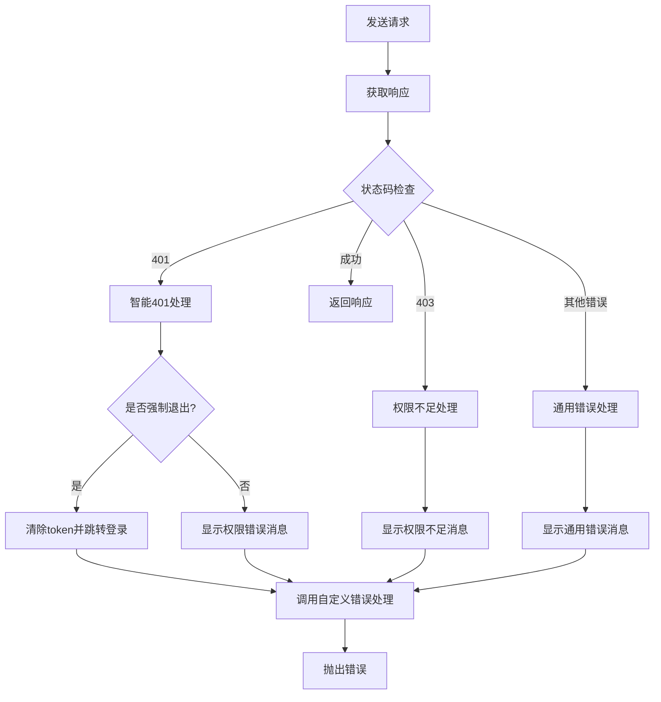

# 前端请求工具增强文档

## 变动概述

本次更新对 `frontend/src/utils/request.ts` 进行了重大增强，主要解决了以下问题：

1. **智能401错误处理**：避免用户因权限不足而被误退出登录
2. **可配置的错误处理策略**：支持不同场景下的错误处理需求
3. **统一的错误消息管理**：提供一致的用户体验
4. **网络错误处理**：增强网络异常情况下的用户体验

## 新增功能说明

### 1. 错误处理配置接口

新增了 `ErrorHandlingConfig` 接口，允许细粒度控制错误处理行为：

```typescript
interface ErrorHandlingConfig {
  /** 是否自动处理401错误（清除token并跳转登录页） */
  autoHandle401?: boolean;
  /** 是否显示错误消息提示给用户 */
  showErrorMessage?: boolean;
  /** 自定义错误处理回调函数，用于特殊的错误处理逻辑 */
  onError?: (error: Error, response?: Response) => void;
}
```

### 2. 全局错误处理配置

提供了全局配置功能，可以在应用启动时设置默认的错误处理策略：

```typescript
// 设置全局配置
setGlobalErrorConfig({
  autoHandle401: false,  // 禁用自动401处理
  showErrorMessage: true,
  onError: (error, response) => {
    // 全局错误处理逻辑
    console.error('全局错误:', error);
  }
});
```

### 3. 智能401错误处理

新增了智能的401错误判断逻辑，避免误退出登录：

- **强制退出场景**：
  - 认证相关端点（登录、刷新token、登出）的401错误
  - 获取用户信息接口的401错误

- **不强制退出场景**：
  - 业务接口的401错误（可能只是权限不足）

### 4. 专用请求函数

提供了两个专用的请求函数：

#### silentFetch - 静默请求
```typescript
// 不显示错误消息，不自动处理401
const response = await silentFetch('/api/background-sync');
```

#### noAutoLogoutFetch - 不自动登出请求
```typescript
// 显示错误消息但不自动退出登录
const response = await noAutoLogoutFetch('/api/admin/sensitive-data');
```

### 5. 自定义fetch函数创建器

提供了 `createFetch` 函数，可以创建具有特定错误处理策略的fetch函数：

```typescript
const customFetch = createFetch({
  showErrorMessage: false,
  onError: (error) => {
    // 自定义错误处理
    sendErrorToAnalytics(error);
  }
});
```

## 修改的功能说明

### 1. 增强的错误处理逻辑

**原有逻辑**：
- 所有401错误都会强制退出登录
- 错误处理策略固定，无法自定义

**新逻辑**：
- 智能判断401错误是否需要强制退出
- 支持可配置的错误处理策略
- 提供自定义错误处理回调

### 2. 改进的网络错误处理

**原有逻辑**：
- 简单的网络错误提示

**新逻辑**：
- 详细的网络错误分类和处理
- 支持自定义网络错误处理
- 更友好的错误消息

### 3. 扩展的请求配置

**原有逻辑**：
- 只支持标准的RequestInit配置

**新逻辑**：
- 扩展支持errorHandling配置
- 自动清理自定义配置，避免传递给原生fetch

## 代码结构说明

### 核心组件

```
request.ts
├── ErrorHandlingConfig          # 错误处理配置接口
├── globalErrorConfig           # 全局错误处理配置
├── setGlobalErrorConfig()      # 设置全局配置函数
├── isAuthEndpoint()           # 认证端点检查函数
├── shouldForceLogout()        # 强制退出判断函数
├── window.fetch (enhanced)    # 增强的fetch函数
├── createFetch()             # 自定义fetch创建器
├── silentFetch              # 静默请求函数
└── noAutoLogoutFetch        # 不自动登出请求函数
```

### 错误处理流程



## 使用示例

### 1. 基础使用（无需修改现有代码）

```typescript
// 现有代码无需修改，自动享受增强功能
const response = await fetch('/api/users');
const data = await response.json();
```

### 2. 配置全局错误处理

```typescript
// 在应用启动时配置
import { setGlobalErrorConfig } from '@/utils/request';

setGlobalErrorConfig({
  autoHandle401: true,
  showErrorMessage: true,
  onError: (error, response) => {
    // 发送错误到监控系统
    analytics.track('api_error', {
      message: error.message,
      status: response?.status,
      url: response?.url
    });
  }
});
```

### 3. 静默后台请求

```typescript
import { silentFetch } from '@/utils/request';

// 后台数据同步，不打扰用户
const syncData = async () => {
  try {
    const response = await silentFetch('/api/sync');
    const data = await response.json();
    // 处理同步数据
  } catch (error) {
    // 静默处理错误，记录日志
    console.error('同步失败:', error);
  }
};
```

### 4. 权限敏感操作

```typescript
import { noAutoLogoutFetch } from '@/utils/request';

// 尝试访问管理员功能，失败时不退出登录
const tryAdminOperation = async () => {
  try {
    const response = await noAutoLogoutFetch('/api/admin/users');
    const users = await response.json();
    return users;
  } catch (error) {
    // 会显示"权限不足"消息，但不会退出登录
    console.error('权限不足:', error);
    return null;
  }
};
```

### 5. 自定义错误处理

```typescript
import { createFetch } from '@/utils/request';

// 创建专用的fetch函数
const analyticsRequest = createFetch({
  showErrorMessage: false,  // 不显示错误消息
  onError: (error, response) => {
    // 发送到错误监控系统
    errorReporting.captureException(error, {
      tags: {
        component: 'analytics',
        status: response?.status
      }
    });
  }
});

// 使用自定义fetch
const trackEvent = async (event) => {
  try {
    await analyticsRequest('/api/analytics/track', {
      method: 'POST',
      body: JSON.stringify(event)
    });
  } catch (error) {
    // 错误已被自定义处理器处理
  }
};
```

### 6. 单次请求自定义配置

```typescript
// 为单次请求设置特殊的错误处理
const response = await fetch('/api/sensitive-operation', {
  method: 'POST',
  body: JSON.stringify(data),
  errorHandling: {
    autoHandle401: false,  // 这次请求不自动处理401
    showErrorMessage: false,  // 不显示错误消息
    onError: (error) => {
      // 自定义错误处理
      showCustomErrorDialog(error.message);
    }
  }
} as any);
```

## 注意事项

### 1. 向后兼容性

- ✅ 现有代码无需修改即可享受新功能
- ✅ 所有原有的fetch调用都会自动使用新的错误处理逻辑
- ✅ 默认配置保持与原有行为一致

### 2. 性能考虑

- ✅ 错误处理逻辑轻量化，不影响正常请求性能
- ✅ 智能判断逻辑简单高效
- ✅ 缓存了全局配置，避免重复计算

### 3. 安全性

- ✅ 智能401处理避免了误退出登录的安全风险
- ✅ 敏感信息（如token）的清理逻辑更加精确
- ✅ 错误信息不会泄露敏感数据

### 4. 调试和监控

- ✅ 提供了丰富的错误处理回调，便于集成监控系统
- ✅ 错误信息包含了足够的上下文信息
- ✅ 支持自定义错误处理逻辑，便于调试

### 5. 使用建议

1. **全局配置**：在应用启动时设置合适的全局错误处理配置
2. **静默请求**：对于后台同步、轮询等操作使用 `silentFetch`
3. **权限检查**：对于可能因权限不足而失败的操作使用 `noAutoLogoutFetch`
4. **错误监控**：利用 `onError` 回调集成错误监控系统
5. **用户体验**：根据具体场景选择合适的错误处理策略

### 6. 常见问题

**Q: 为什么有些401错误不会退出登录？**
A: 新的智能判断逻辑会区分真正的认证失败和权限不足。只有在确认token无效时才会强制退出登录。

**Q: 如何禁用自动错误消息显示？**
A: 可以通过 `setGlobalErrorConfig({ showErrorMessage: false })` 全局禁用，或使用 `silentFetch` 进行静默请求。

**Q: 如何集成错误监控系统？**
A: 通过 `onError` 回调可以轻松集成各种错误监控系统，如Sentry、Bugsnag等。

**Q: 现有代码需要修改吗？**
A: 不需要。所有现有的fetch调用都会自动享受新的错误处理功能，保持完全的向后兼容性。

## 相关文件

- `frontend/src/utils/request.ts` - 主要实现文件
- `frontend/src/services/authService.ts` - 认证服务（使用了请求工具）
- `frontend/src/services/userService.ts` - 用户服务（使用了请求工具）
- `frontend/src/services/menuService.ts` - 菜单服务（使用了请求工具）

## 后续优化建议

1. **请求重试机制**：为网络错误添加自动重试功能
2. **请求缓存**：为GET请求添加智能缓存机制
3. **请求去重**：避免重复的并发请求
4. **离线支持**：添加离线状态检测和处理
5. **性能监控**：集成请求性能监控和分析