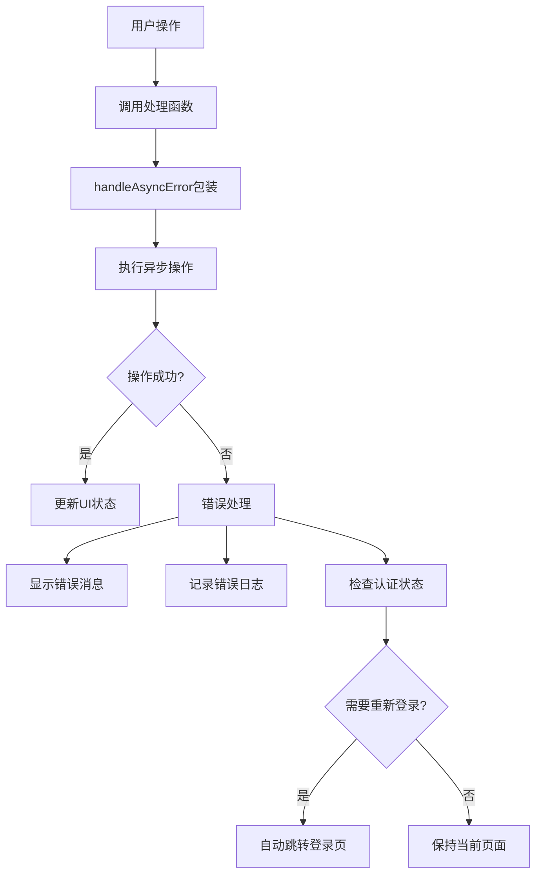

# 用户管理页面错误处理集成文档

## 变动概述

本次更新为用户管理页面（`frontend/src/pages/UserManagement/index.tsx`）集成了统一的错误处理机制，通过引入 `useErrorHandler` 钩子，实现了更加健壮和用户友好的错误处理体验。

## 新增功能说明

### 1. 统一错误处理集成

- **引入错误处理钩子**：集成 `useErrorHandler` 钩子，提供统一的错误处理能力
- **异步错误处理**：使用 `handleAsyncError` 方法包装所有异步操作
- **自定义错误消息**：为不同操作提供个性化的错误提示信息

### 2. 错误处理覆盖范围

集成了以下操作的错误处理：

- **数据加载**：用户列表、角色列表、统计信息加载
- **用户操作**：创建、更新、删除用户
- **状态管理**：用户状态切换、用户解锁
- **搜索和分页**：搜索参数变更、分页操作

## 修改的功能说明

### 1. 数据加载优化

```typescript
const loadData = async () => {
  setLoading(true);
  try {
    await handleAsyncError(async () => {
      // 并发请求多个接口，提高性能
      const [userResponse, rolesData, statsData] = await Promise.all([
        userService.getUserList(searchParams),
        userService.getRoleList(),
        userService.getUserStatistics(),
      ]);
      
      // 更新状态
      setUsers(userResponse.results);
      setRoles(rolesData);
      setStatistics(statsData);
    }, {
      customMessage: '加载用户数据失败，请稍后重试',
      showMessage: true,
    });
  } catch (error) {
    // 错误已经被handleAsyncError统一处理
  } finally {
    setLoading(false);
  }
};
```

**改进点：**
- 使用 `handleAsyncError` 包装异步操作
- 提供自定义错误消息
- 保持原有的并发请求逻辑

### 2. 用户操作错误处理

```typescript
const handleDeleteUser = async (userId: string) => {
  if (!confirm('确定要删除此用户吗？')) {
    return;
  }

  try {
    await handleAsyncError(async () => {
      await userService.deleteUser(userId);
      loadData();
    }, {
      customMessage: '删除用户失败，请稍后重试',
      showMessage: true,
    });
  } catch (error) {
    // 错误已经被handleAsyncError处理
  }
};
```

**改进点：**
- 移除了手动的 `console.error` 和 TODO 注释
- 使用统一的错误处理机制
- 提供用户友好的错误提示

### 3. 代码注释完善

为所有关键函数和状态变量添加了详细的中文注释：

- **状态变量注释**：说明每个状态的用途和数据类型
- **函数注释**：使用 JSDoc 格式，包含参数说明和功能描述
- **逻辑注释**：解释复杂逻辑的实现思路

## 代码结构说明

### 1. 组件结构

```
UserManagement/
├── index.tsx              # 主组件文件
├── components/
│   ├── UserList.tsx       # 用户列表组件
│   ├── UserForm.tsx       # 用户表单组件
│   ├── RoleManagement.tsx # 角色管理组件
│   └── UserStatisticsCard.tsx # 统计卡片组件
└── style.scss            # 样式文件
```

### 2. 状态管理

```typescript
// 页面状态管理
const [activeTab, setActiveTab] = useState<'users' | 'roles'>('users');
const [users, setUsers] = useState<User[]>([]);
const [roles, setRoles] = useState<Role[]>([]);
const [statistics, setStatistics] = useState<UserStatistics | null>(null);
const [loading, setLoading] = useState(false);
const [showUserForm, setShowUserForm] = useState(false);
const [editingUser, setEditingUser] = useState<User | null>(null);

// 搜索和过滤参数状态
const [searchParams, setSearchParams] = useState({
  search: '',
  role: '',
  isActive: undefined as boolean | undefined,
  isAdmin: undefined as boolean | undefined,
  ordering: '-date_joined',
  page: 1,
  pageSize: 20,
});
```

### 3. 错误处理流程



## 使用示例

### 1. 基本错误处理

```typescript
// 简单的异步操作错误处理
const handleSimpleOperation = async () => {
  try {
    await handleAsyncError(async () => {
      await someAsyncOperation();
    }, {
      customMessage: '操作失败，请稍后重试',
      showMessage: true,
    });
  } catch (error) {
    // 错误已被统一处理
  }
};
```

### 2. 带有认证检查的错误处理

```typescript
// 需要认证的操作
const handleAuthenticatedOperation = async () => {
  try {
    await handleAsyncError(async () => {
      await authenticatedOperation();
    }, {
      customMessage: '操作失败，请检查权限',
      showMessage: true,
      logoutOnAuthError: true, // 认证失败时自动退出登录
    });
  } catch (error) {
    // 错误已被统一处理
  }
};
```

### 3. 表单提交错误处理

```typescript
// 表单提交时的错误处理
const handleFormSubmit = async (formData: any) => {
  try {
    await handleAsyncError(async () => {
      await submitForm(formData);
      // 成功后的操作
      closeForm();
      refreshData();
    }, {
      customMessage: '提交失败，请检查输入信息',
      showMessage: true,
    });
  } catch (error) {
    // 重新抛出错误，让表单组件处理字段级错误
    throw error;
  }
};
```

## 注意事项

### 1. 错误处理最佳实践

- **统一使用 handleAsyncError**：所有异步操作都应该使用 `handleAsyncError` 包装
- **提供有意义的错误消息**：使用 `customMessage` 提供用户友好的错误提示
- **避免重复错误处理**：不要在 `handleAsyncError` 外层再次处理相同的错误
- **保持错误传播**：在需要上层组件处理的场景下，重新抛出错误

### 2. 性能考虑

- **并发请求**：使用 `Promise.all` 进行并发请求，提高加载性能
- **避免不必要的重新渲染**：合理使用 `useCallback` 和 `useMemo`
- **分页加载**：大数据量时使用分页，避免一次性加载过多数据

### 3. 用户体验

- **加载状态**：显示适当的加载指示器
- **错误反馈**：提供清晰的错误信息和解决建议
- **操作确认**：危险操作（如删除）需要用户确认
- **自动重试**：网络错误时可以考虑自动重试机制

### 4. 安全考虑

- **权限检查**：所有操作都应该进行权限验证
- **输入验证**：客户端和服务端都要进行输入验证
- **敏感操作日志**：记录重要操作的审计日志
- **会话管理**：认证失败时及时清理本地状态

### 5. 代码维护

- **注释完整性**：保持代码注释的及时更新
- **类型安全**：充分利用 TypeScript 的类型检查
- **测试覆盖**：为关键功能编写单元测试和集成测试
- **代码复用**：将通用逻辑抽取为可复用的钩子或工具函数

## 相关文件

- `frontend/src/hooks/useErrorHandler.ts` - 错误处理钩子实现
- `frontend/src/pages/UserManagement/index.tsx` - 用户管理主组件
- `frontend/src/services/userService.ts` - 用户服务接口
- `frontend/src/types/index.ts` - 类型定义文件
- `frontend/src/store/auth.ts` - 认证状态管理

## 后续优化建议

1. **错误分类**：根据错误类型提供不同的处理策略
2. **重试机制**：为网络错误添加自动重试功能
3. **离线处理**：添加离线状态检测和处理
4. **错误上报**：集成错误监控服务，自动上报错误信息
5. **国际化**：支持多语言错误消息